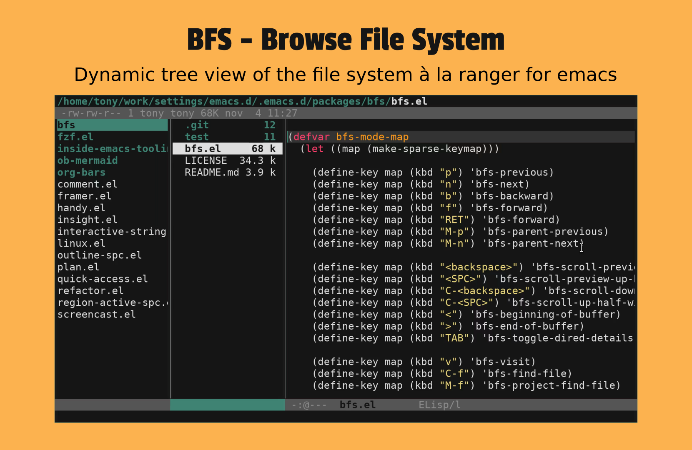

# About

`bfs` (Browse File System) implements for `emacs` a dynamic tree view
of the file system à la [ranger](https://github.com/ranger/ranger).



# Install

Put [bfs.el](./bfs.el) in your load path and add this to your init
file:

```elisp
(require 'bfs)
```

# Usage

## Basic

To start `bfs` "environment" in the selected frame, run:

```elisp
M-x bfs
```

Then in the child window (the center window), you can press the keys
`p`, `n`, `M-p`, `M-n`, `b` and `f` to select the files to be
previewed.

You can scroll the preview window (the right window) from the child
window by pressing the keys `<SPC>` and `<backspace>`.

You can quit `bfs` either by:
1. pressing the key `q` or,
2. calling any command that invalidates `bfs` "environment" (see
`bfs-check-environment`).

For instance, your `bfs` "environment" stops to be valid:
- when you switch to a buffer not attached to a file,
- when you modify the layout deleting or rotating windows,
- when you run any command that makes the previewed buffer
  no longer match the child entry (filename in the child window).

**Note 1:** If you call bfs with universal argument, `bfs` starts
by previewing the "file" (see `bfs-child-default`) of the
`current-buffer` in the preview window.  If you call `bfs` without
universal argument, `bfs` starts with the last file you've visited in
the `bfs` "environment".

**Note 2:** You can only have one `bfs` "environment" running at a
time.

**Note 3:** All the commands (except `bfs`) are provided via the
`bfs-mode-map` that is the local map used in the child window (the
center window).

**Note 4:** You can use `isearch` commands to select files in the
child window, the preview window will be updated automatically.

## Finding files

`bfs` provides two commands `bfs-find-file` and
`bfs-project-find-file` respectively bound to `C-f` and `M-f` to find
files.  Those commands automatically update `bfs` "environment" once
you've selected the file.

If what you want is to find a file and leave `bfs` "environment", just
use the emacs built-in commands `find-file` and `project-find-file`.

## Marking files

`bfs` comes with its mark system that allows you to mark child
entries and kill marked entries (not the files).  The commands
provided are bound in `bfs-mode-map` as follow:

| key | command            |
| --- | ------------------ |
| `m` | `bfs-mark`         |
| `u` | `bfs-unmark`       |
| `U` | `bfs-unmark-all`   |
| `t` | `bfs-toggle-marks` |
| `k` | `bfs-kill-marked`  |
| `%` | `bfs-mark-regexp`  |

## Filetering

You can filter the files listed in the child window with the following
commands:
1. `bfs-hide-dotfiles` (bound to `.`) toggles the visibility of
   dotfiles,
2) `bfs-narrow` (bound to `/`) dynamically filters (narrows) `bfs`
   child buffer to filenames matching a regexp read from minibuffer.

# Options

I'll document this section later.

But until it is done you can find most of the user options in the
section `User options` of [bfs.el](./bfs.el) file.

# Features from `ranger`

I've never used `ranger` so I won't miss nothing from it.  Another
consequence is that I'm not trying to implement the features it
offers.  But, I really like its layout.  I think it offers so far the
best way to *discover code bases* and to *browse file systems*.

From the beginning, the unique goal of `bfs` has been to give to emacs
users a way to dynamically visualize the structure of their file
system with file preview. **Nothing more**

# `bfs` is not a file manager

`bfs` is not a file manager.  It doesn't provide any commands to
copy, paste, rename, modify ownership, compress files...  Those
features are already implemented in others tools like `dired` and
`wdired`.  And if you need to do more elaborated tasks on your files
you still can use your favorite `shell`.

`bfs` doesn't try to replace or re-implement features from those
tools.

However, `bfs` is implemented in such a way that it is possible to
implement these features on top of each other in separate packages.
